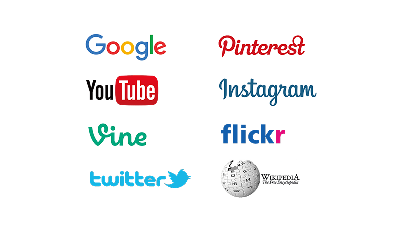

---

##スケジュール
--  
#####1日目 
- **自己紹介**
- **授業全体の話**
- **リサーチ&SNSの使い方**
  - SNSの使い方紹介
  - お題
  - 代表的なSNSを使ってみる
- **お題**
  - サンプル
- **ブレインストーミング**
  - 企画を考えよう
  - ドメインを探そう！
- **デザインをする**

※2日目の授業前までにテーマを提出

--  
#####2日目 
- **サイトを編集する**
  - Atom
  - HTML、jQuery
  - プラグイン変更方法
  - googleマイマップ
  - instagram
  - Twitter
  
--  
#####3日目
- **発表**

---

##1日目

###講師自己紹介

本末英樹（モトスエヒデキ）  
Webデザイナー


####最近のお仕事

**Tadaima Japan**  
[http://tadaimajp.com/](http://tadaimajp.com/)

**docomyanmar**  
[http://docomyanmar.com/popamt/](http://docomyanmar.com/popamt/)


###リサーチ&SNSの使い方



####SNSの使い方紹介
- Twitter検索
- Instagram検索
- Google Map検索
- pinterest
- poket
- feedly
- はてぶ
- delicious
- Evernote
- youtube
- Foursquare

どこまでしってるかな？？

--

####お題
#####外国人向けに日本の観光スポットを俺視点で紹介

2014年、ついて訪日観光客が1,000万人を超えた。（1341万人）
今年は一気に2000万人を突破するかも？！  
ビザの緩和、円安もあり、オリンピックに向けて、更に加速する日本観光。  

日本が今、海外から注目されている！


##「俺、私的観光スポットガイドサイトを作る」
外国人向けに日本の観光スポットモノを俺/私の視点で紹介する。  
ありきたりな環境スポットではなく、みんなが知らないところ、あっと驚くような場所をネットで調べて紹介する。

サンプルサイト  
**おにぎりジャパン**  
[http://onigirijp.com/](http://onigirijp.com/)

--

####Confeito
金平糖というテーマや、コンセプトの原稿が作りこまれていて、面白い。  
[http://oronain.com/seikauni/151021/215q017/](http://oronain.com/seikauni/151021/215q017/)

####いなかでんしゃ
田舎の電車というテーマも良く、ロゴタイトルやキービジュアルも上手くテーマを表現できている。コピーも良い。  
[http://oronain.com/seikauni/151021/215q025/](http://oronain.com/seikauni/151021/215q025/)

####じゃぱだがし -日本の駄菓子文化マガジン
駄菓子というテーマ自体は面白くはないが、ターゲット、メディアとしての今後の展開やビジュアルデザインがとても丁寧に考え、作られており、完成度が高い。唯一CSSも独自でカスタマイズして、楽しいサイトに仕上がった。  
[http://oronain.com/seikauni/151021/215q029/](http://oronain.com/seikauni/151021/215q029/)

--

#### 代表的なSNSを使って見る

Googlemap、Instagram、Twittwrを使って検索してみよう！


--

#####googlemap

(例)

- 軍艦島
- パックマン
- ポケモンチャレンジ
- googlemapでも火星や月が見れる
- [group_inou / EYE (PV)](https://goo.gl/ELefFi)  


[ストリートビュー](https://www.google.co.jp/intl/ja/maps/streetview/)


--

#####Instagram

(例)

- [ハムスター「Darcy」](https://instagram.com/darcytheflyinghedgehog/)
- [小籔千豊](https://instagram.com/koyabukazutoyo_shinkigeki/)

圧倒的女子力!?　小籔千豊のInstagramがじわじわ来る  
[https://instagram.com/koyabukazutoyo_shinkigeki/](https://instagram.com/koyabukazutoyo_shinkigeki/)  
小籔さんは、なんと最近女性誌の専属モデルになったことでも話題になっているんです。しかも、「NYLON JAPAN」「ViVi」「VOCE」の3誌同時に  
カズニョロポーズ

- japansnack
- japanesetattoo


--

#####Twitter

(例)

- ツイッター担当者にニワトリを起用　豪チェーン店  
ニワトリのツイートが話題に＝チキン・トリートから  
[https://twitter.com/chickentreat](https://twitter.com/chickentreat)  
[http://www.chickentreat.com.au/](http://www.chickentreat.com.au/)

- natto

--

#####Google

Google トレンド - 急上昇ワード  
[https://www.google.com/trends/hottrends/visualize?pn=p4&hl=ja&nrow=5&ncol=5](https://www.google.com/trends/hottrends/visualize?pn=p4&hl=ja&nrow=5&ncol=5)


--

####代表的な訪日外国人用の観光サイト

**Time Out Tokyo**  
[http://www.timeout.jp/tokyo/ja](http://www.timeout.jp/tokyo/ja)

**IS JAPAN COOL**  
[https://www.ana-cooljapan.com/](https://www.ana-cooljapan.com/)


--

####代表的な訪日外国人用の観光ガイドブック


- TimeOUT tokyo
- Discover Japan
- Monocle
- lonely planet


--

####他にも

**YOUは何しに日本へ？**  
[http://www.tv-tokyo.co.jp/youhananishini/](http://www.tv-tokyo.co.jp/youhananishini/)


サイトやガイドブックに載っていないような  
面白いスポットやモノを世界に発信しよう！


---


###ブレインストーミング
チームでアイデアを出し合おう

お弁当、ハローキティ、ラーメン、盆栽...  
いろんな日本が海外で流行っている。

何が流行っているか調べよう！  
まだ流行っていないが面白いものを見つけよう！

観光スポットについては、グループでブレスト。  

1. 自分で検索 30分
2. ブレスト 30分


###A4企画シート作成

サイトのコンセプトや概要を企画書にまとめてください。
このA4一枚を見ただけで、別の誰かがサイトをイメージできるように。


####コンセプト
サイトのコンセプトを表す言葉を完結に書いてください

例） 日本のファーストフード「おにぎり」を世界に広めるサイト


####サイト名
例）おにぎりジャパン


####ターゲット
ターゲットとなるユーザーを記入

例）欧米（アメリカ、イギリス、カナダ、オーストラリア）の20代


####場所やモノ
このサイトで何を紹介するか記入

例）コンビニのおにぎり


####ドメイン
ムームードメインで取得可能なドメインを1つ探して記入

例）onigirijp.com


####企画概要
サイトの企画内容をできるだけ具体的に記入

例）日本のファーストフードとも言えるおにぎり。
コンビニで気軽に購入することができるため、訪日観光客が購入することも少なくありません。
しかし、包装紙の開け方が難しく、正しい食べ方ができる人はごく僅か。
そこで、OnigiriJPでは、おにぎりの食べ方と魅力をInstagramを使って
世界に発信していきます。

--

####POINT!!

- コンセプトだけでなく、アウトプットが面白くなっているか
- GoogleMap、Instagram、Twitterの結果は、コンセプトに紐付いているか


--

#####ドメインを探そう！

Webサービス作る時は、ドメイン名（URLアドレス）が取得できるかどうかも大事。  
サイト名にあったドメインを探そう。

**ドメインとは**  
インターネット上にあるコンピューターを特定するために使われるもの

**ムームードメイン**  
ドメインを取得できる会社
[https://muumuu-domain.com/](https://muumuu-domain.com/)

```
「onigiri」で取得可能だったドメイン例
onigirijp.com
onigiri.style
onigiri.school
onigiri.gallery
onigiri.pictures
```


####2日目の授業前までにテーマを提出


###デザインをする


**デザインを変更できるポイント**

- ロゴ画像の変更（サイズ自由）
- トップバナー（キービジュアル）の変更（横幅1200px）
- サイト概要部分の画像変更（サイズ自由）
- ライター写真画像の変更（220px x 220px）

その他のデザイン修正は、HTMLとCSSの技術が必要。  
変更したい方は講師に個別で質問してください。

###PhotoshopでWebデザイン


#####1.表示サイズ
皆さんが使っているモニターはレティナディスプレイなので、  
Photoshopの表示を200%にしてデザインを作成

#####2.カラー設定
イメージ > モード > RGBカラー

#####3.解像度
イメージ > 画像解像度 > 72pixl


#####4.画像アセット
- Photoshopメニュー > 生成 > 画像アセット　にチェックを入れる
- レイヤーパネル > 書き出したいレイヤー（フォルダでも良い）にファイル名をつける
例) keyimg.png
- psdデータが保存されている場所に、書き出された画像の入ったフォルダが生成


#####5.イラストレーターデータを使う
- illustratorでロゴやイラストを作成
- パスを選択しコピー
- photoshopの画面でペースト
- スマートオブジェクトで配置

**スマートオブジェクトとは**  
配置またはペーストされた画像を、元の画質を保持したまま編集や拡大・縮小、回転、ワープが可能な機能


###デザイン参考サイト

- [http://io3000.com/](http://io3000.com/)
- [http://w-finder.com/](http://w-finder.com/)
- [https://dribbble.com/](https://dribbble.com/)
- [https://jp.pinterest.com/](https://jp.pinterest.com/)
- [https://www.behance.net/](https://www.behance.net/)


---

##2日目


###サイトを編集する

- ATOM（テキストエディタ）インストール
- Instagramのウィジェットの使い方
- Google Map APIの使い方（マイマップにする？）
- Twitterウィジェットの使い方

####事前に用意するもの
- Atomのダウンロード
- Googleアカウントの取得
- Twitterアカウントの取得
- Instagramアカウントの取得


###HTMLコーディング

##### 1.HTMLとは
要素定義

##### 2.CSSとは
見た目

##### 3.JavaScriptとは
インタラクション


####Atom
GitHub製テキストエディターです。
[https://atom.io/](https://atom.io/)   
※普段使ってるエディターがある人は、そちらを使用しても結構です。

**今注目のテキストエディタ「Atom」の使い方と便利機能まとめ**  
[http://blog.codecamp.jp/atom_utility/](http://blog.codecamp.jp/atom_utility/)


#####インストールするパッケージ

- Japanese-menu


###Google マイマップ
自分の地図を作成してオンラインで作成して、共有できるサービスです。  
[https://www.google.co.jp/mymaps/](https://www.google.co.jp/mymaps/)

1. 検索フォームにスポット名か住所を入れ、検索
2. 地図に追加　リンクをクリック


####ソースコードのコピー
完成したマップ情報をソースコードとして表示します。

1. 「共有」ボタンをクリック
2. 「変更」をクリック
3. 「オン - ウェブ上で一般公開」を選択
4. 「保存」をクリック
5. 「共有」ボタン横の点3つのアイコンをクリック
6. 「自分のサイトに埋め込む」をクリック
7. フレーム内に書かれたソースコードをコピー

####ソースコードをにペースト
ソースコードをHTMLデータにペーストして、完成です。

index.htmlをAtomで開きます。 ソースコードの「Google My Map」と書かれた場所にペーストし、  
下記のように書き換えます。

```
<!-- Google My Map -->
<iframe src="https://www.google.co.jp/maps/d/embed?mid=zBnJnIAw-70k.k7JC22K7O5T8" width="640" height="480" frameborder="0"></iframe>
<!-- /Google My Map -->
```


###Twitter
Twitterのウィジェット公式ページ  
[https://twitter.com/settings/widgets](https://twitter.com/settings/widgets)  
※Twitterのアカウントが必要です

1. ウィジット 新規作成 > 検索タブ
1. 設定 検索クエリにハッシュタグを入れる
1. ウェジットを作成ボタンをクリック
1. ソースコードを選択してコピー
1. HTMLの「Twitter」と書かれた場所にペースト

```
<!-- Twitter -->
<a class="twitter-timeline" href="https://twitter.com/search?q=%E3%81%8A%E3%81%AB%E3%81%8E%E3%82%8A" data-widget-id="655432896212176897">おにぎりに関するツイート</a>
<script>!function(d,s,id){var js,fjs=d.getElementsByTagName(s)[0],p=/^http:/.test(d.location)?'http':'https';if(!d.getElementById(id)){js=d.createElement(s);js.id=id;js.src=p+"://platform.twitter.com/widgets.js";fjs.parentNode.insertBefore(js,fjs);}}(document,"script","twitter-wjs");</script>
<!-- /Twitter -->
```


###Instagram

**instafeed.js**  
Instagramを簡単に表示するためのJavaScriptプラグイン  
[http://instafeedjs.com/](http://instafeedjs.com/)


---

##3日目
####13:00-14:00
作業

####14:00-14:30
課題データ提出  
チーム内講評  

####14:40〜17:40
発表、講評  
全員発表 1人5分

